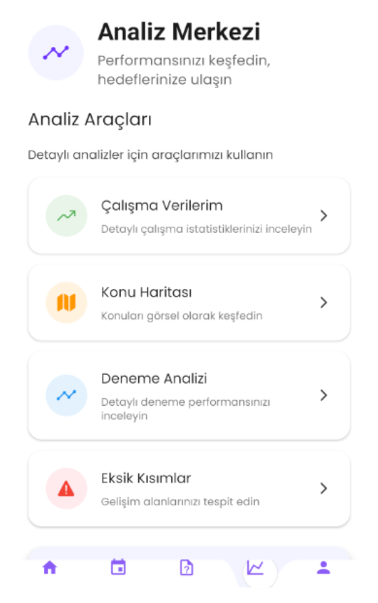
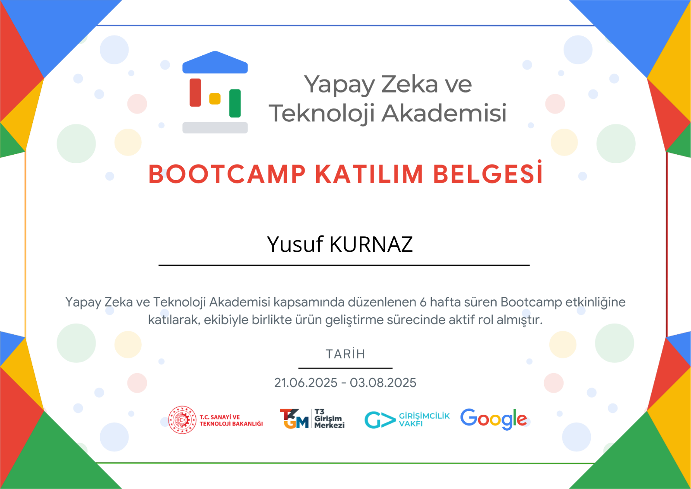

# 🎯 YÖN - AI-Powered Exam Preparation Platform


> **Bootcamp Project:** Developed for the "Yapay Zeka ve Teknoloji Akademisi" Bootcamp Competition  
> **Role:** Full Stack Developer  
> **Responsibilities:** Complete system architecture, backend development, mobile app development, AI integration, and deployment

---

## 📋 Project Overview

**YÖN** is an intelligent exam preparation platform designed to help students prepare for standardized tests (TYT/AYT) through personalized study plans, AI-powered analytics, and adaptive learning techniques.

### 📱 Application Screenshots

| Dashboard | Analysis | Mind Map |
|-----------|----------|----------|
|  |  |  |

| Tech Stack | Daily Tasks | Question Box |
|------------|-------------|--------------|
|  |  |  |

| Profile | Additional Screens |
|---------|--------------------|
|  |  |

### 🏆 Key Achievements
- **Full Stack Development:** Designed and developed the entire system from scratch
- **AI Integration:** Implemented Gemini AI for mind mapping and intelligent question analysis
- **Scalable Architecture:** Built with Django REST Framework and React Native (Expo)
- **Real-time Sync:** Firebase integration for real-time data synchronization
- **Performance Optimized:** Efficient query optimization and caching strategies

---

## 🏗️ System Architecture

```
YÖN Platform
│
├── Backend (Django REST Framework)
│   ├── RESTful API with JWT Authentication
│   ├── Firebase Integration (Auth & Firestore)
│   ├── Google Gemini AI Integration
│   └── Modular App-Based Architecture
│
├── Mobile App (React Native + Expo)
│   ├── Cross-platform (iOS & Android)
│   ├── Firebase Authentication
│   └── Real-time Data Synchronization
│
└── AI Services
    ├── Gemini AI for Mind Maps
    ├── Performance Analytics
    └── Quick Solution Generation
```

---

## 🚀 Technology Stack

### **Backend**
- Django 5.2.4 + Django REST Framework 3.15
- Firebase (Firestore, Storage, Authentication)
- Google Gemini API for AI features
- JWT + Firebase Auth

### **Frontend (Mobile)**
- React Native 0.79 + Expo 53
- TypeScript 5.8
- Expo Router (File-based routing)
- React Native Paper + Custom Components

### **AI & Analytics**
- Google Gemini AI for mind map generation
- Custom analytics engine for performance tracking
- Spaced Repetition Algorithm (SM-2)

---

## 📦 Project Structure

```
Direction_App/
│
├── backend/                          # Django REST API
│   ├── users/                        # User management & JWT auth
│   ├── exams/                        # Exam system (hierarchical topics)
│   ├── flashcards/                   # Flashcard & spaced repetition
│   ├── coaching/                     # Performance analytics & recommendations
│   ├── analytics/                    # AI-powered analysis engine
│   ├── mindmaps/                     # AI mind map generation
│   ├── quick_solutions/              # Image-based question solving
│   ├── tasks/                        # Daily task management
│   ├── notifications/                # Push notification system
│   └── core_backend/                 # Project configuration
│       └── utils/                    # Shared utilities (API responses)
│
├── mobile/yon-app/                   # React Native Mobile App
│   ├── app/                          # Expo Router screens
│   ├── components/                   # Reusable UI components
│   ├── services/                     # API & Firebase services
│   └── hooks/                        # Custom React hooks
│
└── docs/                             # Documentation & assets
```

---

## 💡 Core Features

### 🔐 **User Management**
- JWT-based authentication
- Firebase authentication integration
- Google Sign-In support

### 📚 **Hierarchical Exam System**
- Categories: TYT, AYT, Language, Military Exams
- Self-referencing tree structure for topics
- Multiple choice questions with difficulty levels

### 🧠 **AI-Powered Features**
- **Mind Map Generator:** AI-generated visual learning maps from voice input
- **Quick Solutions:** Image-based question analysis with step-by-step solutions
- **Performance Analytics:** Weak topic detection and personalized recommendations
- **Smart Coaching:** AI-driven study plan generation

### 📊 **Analytics & Insights**
- Comprehensive exam analysis
- Subject-level performance tracking
- Progress visualization with charts
- Spaced repetition optimization

### 🃏 **Flashcard System**
- Custom flashcard decks
- Spaced repetition algorithm (SM-2)
- Auto-generated flashcards from topics

---

## 🗂️ Database Schema

```
ExamCategory (TYT/AYT)
    ↓
Subject (Math/Physics/Chemistry)
    ↓
Topic (Self-referencing tree)
    ↓
Question (Multiple choice)

User
    ↓
ExamRecord → UserQuestionAnswer
SubjectPerformance
FlashcardProgress
StudySession
```

---

## 🚀 Getting Started

### **Prerequisites**
- Python 3.10+
- Node.js 18+
- Firebase Account
- Google Gemini API Key

### **Backend Setup**

```bash
cd backend
pip install -r requirements.txt
cp .env.example .env
# Edit .env with your credentials

python manage.py migrate
python manage.py load_topics
python manage.py createsuperuser
python manage.py runserver
```

### **Mobile App Setup**

```bash
cd mobile/yon-app
npm install
# Configure Firebase (google-services.json)

npx expo start
```

---

## 📡 API Endpoints

### **Authentication**
```
POST   /api/v1/auth/register/
POST   /api/v1/auth/login/
GET    /api/v1/auth/profile/
PUT    /api/v1/auth/change-password/
```

### **Exams**
```
GET    /api/v1/exams/categories/
GET    /api/v1/exams/subjects/
GET    /api/v1/exams/topics/tree/
GET    /api/v1/exams/questions/random/
POST   /api/v1/exams/records/
```

### **AI Features**
```
POST   /api/v1/mindmaps/create/
POST   /api/v1/quick-solutions/
POST   /api/v1/analytics/analyze-exam/
```

### **Flashcards & Tasks**
```
GET    /api/v1/flashcards/
GET    /api/v1/flashcards/due/
GET    /api/v1/tasks/daily/
```

---

## 🔧 Key Technical Features

### **Backend**
- Modular Django app-based architecture
- Standardized JSON responses with `api_success`/`api_error` helpers
- Environment-based configuration with `.env`
- Query optimization with `select_related`, `prefetch_related`
- Firebase + JWT dual authentication

### **Frontend**
- File-based routing with Expo Router
- TypeScript for type-safe development
- Reusable component library
- Responsive design for all screen sizes

### **AI Integration**
- Gemini AI for mind maps and question analysis
- Custom algorithms for weak topic detection
- SM-2 spaced repetition implementation

---

## 🧪 Testing

```bash
cd backend
python manage.py test
```

Test coverage includes:
- User authentication and registration
- Exam record creation
- Flashcard spaced repetition
- Performance analytics algorithms

---

## 🚀 Deployment

### **Backend**
- Heroku / AWS EC2 / DigitalOcean
- PostgreSQL on production
- Firebase Storage for media files

### **Mobile App**
- EAS Build (Expo Application Services)
- Google Play Store & Apple App Store

---

## 🎓 Learning Outcomes

This project demonstrates proficiency in:
- Full-stack development (Backend + Mobile)
- RESTful API design and implementation
- Mobile app development with React Native
- AI/ML integration (Google Gemini)
- Firebase ecosystem (Auth, Firestore, Storage)
- Database modeling and optimization
- Real-time data synchronization
- DevOps & deployment strategies

---

## 👨‍💻 Developer

**Full Stack Developer**
- Complete system architecture and design
- Backend API development (Django REST Framework)
- Mobile app development (React Native + Expo)
- AI integration (Gemini API)
- Database schema design
- Firebase integration
- UI/UX implementation

---

## 📄 License & Certification

This project is developed for the "Yapay Zeka ve Teknoloji Akademisi" Bootcamp Competition.

### Bootcamp Participation Certificate



**Yusuf KURNAZ** - Bootcamp Participant  
**Duration:** 21.06.2025 - 03.08.2025 (6 weeks)  
**Role:** System Architecture Design & Full Stack Development

---


